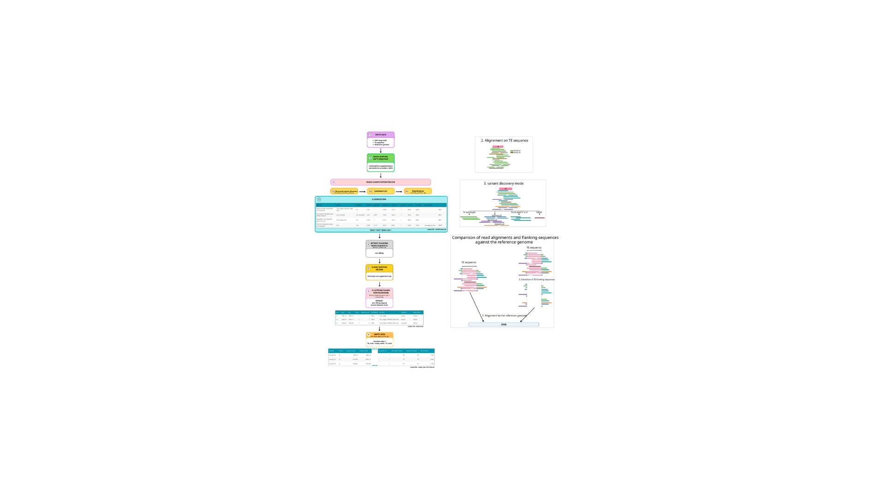

# DEVINATE

## Long-reads TEs insertions finder 

- [Requirements](#requirements)
- [Installation](#installation)
    - [Using Git](#git)
    - [Using Singularity](#singularity)
- [Configuration](#configuration)
- [Usage](#usage)
- [Workflow](#workflow)
- [Outputs](#outputs)
- [Limitations](#limitations)


#### Requirements<a name="requirements"></a>

For this very first version of DEVINATE, we strongly recommend using the provided Conda environment to install all required dependencies :

```bash
conda env create -f devinate.yml
```

Then activate it:

```bash
conda activate devinate
```

| Software   | Version |
|------------|---------|
| Python     | 3.12    |
| Biopython  | 1.87    |
| pysam      | 0.23.3  |
| SeqKit     | 2.9.0   |
| minimap2   | 2.27    |
| samtools   | 1.21    |
| BamDash    | 0.5.0   |

### Installation<a name="installation"></a>

#### Using Git<a name="git"></a>

Once the requirements fullfilled, just *git* clone

```bash
git clone https://github.com/paillerv/DEVINATE.git
```

DEVINATE was developed using these specific tools and versions. This may change in the near future, with a Singularity option. 

#### Using Singularity<a name="singularity"></a> 

TO DO. 

### Configuration<a name="configuration"></a> 

DEVINATE will need :
 - the long-reads (ONT) file, in fasta format
 - the consensus sequence of the TE, in fasta format
 - the reference genome (tested on dm6 only)
 - the prefix output 

A Nextflow implementation of the pipeline is planned to improve workflow reproducibility, scalability, and portability. For now, the pipeline is run directly using the provided Bash script.

### Usage<a name="usage"></a> 

The main bash script DEVINATE_main.sh will sequentially launch the python sub-scripts.

```bash
bash DEVINATE_main.sh \
   ./reads.fasta.gz \
   ./TE-consensus.fasta \
   ./reference-genome.fasta \
   OUTPUT_name
```

### Workflow<a name="workflow"></a>

The DEVINATE pipeline consists of several steps, from TE read mapping and variant discovery to insertion site identification and characterization.



### Outputs<a name="outputs"></a>

Here is an exemple of the structure of the output files obtained after running the pipeline. The `OUTPUT_name` argument used was `EBONT18_ZAM` :

```bash
.
|____EBONT018_ZAM.all_reads_vs_genome.nosupp.q20.bam #raw reads mapped on the reference
|____EBONT018_ZAM.all_reads_vs_ZAM-fl.nosupp.q20.bam #raw reads mapped on the TE
|____EBONT018_ZAM.ZAM-fl.KEEP_readsIds.txt #ids of the reads considered as matching the TE
|____EBONT018_ZAM.ZAM-fl.empty_sites.VAF_freq.tsv #computation of the empty sites
|____EBONT018_ZAM.ZAM-fl.KEEP_reads.fasta #fasta of the reads considered as matching the TE
|____EBONT018_ZAM.ZAM-fl.flanks_vs_genome.bam.bai #index of the *.flanks_vs_genome.bam file
|____EBONT018_ZAM.ZAM-fl.flanks.fasta #fasta of the flank sequences of the reads considered as matching the TE
|____EBONT018_ZAM.ZAM-fl.clusters.tsv #list of detected insertions
|____EBONT018_ZAM.all_reads_vs_genome.nosupp.q20.bam.bai #index of the *.all_reads_vs_genome.nosupp.q20.bam file
|____EBONT018_ZAM.ZAM-fl.compare_flanks_vs_fullreads.tsv #table with the localization, for a same read, where its full sequence and its flanks map
|____EBONT018_ZAM.ZAM-fl.KEEP_reads_vs_genome.nosupp.q20.bam.bai #index of the *.KEEP_reads_vs_genome.nosupp.q20.bam file
|____EBONT018_ZAM.ZAM-fl.KEEP_reads_vs_genome.nosupp.q20.bam #BAM file of the reads matching the TE to the reference 
|____EBONT018_ZAM.ZAM-fl.flanks_vs_genome.bam #BAM file of the flanks to the reference
|____EBONT018_ZAM.all_reads_vs_ZAM-fl.nosupp.q20.bam.bai #index of the *.all_reads_vs_ZAM-fl.nosupp.q20.bam file
|____EBONT018_ZAM.ZAM-fl.insertions.bed #dm6 localization for each read "KEEP" matching the TE
|____EBONT018_ZAM_classification #folder classification
| |____summary.log #stats file with classification reads metrics
| |____EBONT018_ZAM.coverage.html #output of bamdash
| |____EBONT018_ZAM.variants.bed #variants detected from the reads mapped to the TE sequence in BED format 
| |____classification.tsv #table showing the way how each read is mapped to the TE (will result to KEEP or DROP)
| |____auto_discovered_variants.txt #variants detected from the reads mapped to the TE sequence
| |____bam #subfolder with the BAM files corresponding to each detected variant 
| | |____5p_Truncated_DEL_5964-6591.bam.bai 
| | |____3p_Truncated_DEL_5964-6591.bam.bai
| | |____5p_Truncated.bam.bai
| | |____5p_Truncated_DEL_5964-6591.bam
| | |____3p_Truncated.bam.bai
| | |____Full_Length_Like.bam
| | |____Full_Length_Like_DEL_5964-6591.bam
| | |____Full_Length_Like_DEL_5964-6591.bam.bai
| | |____5p_Truncated.bam
| | |____3p_Truncated.bam
| | |____Full_Length_Like.bam.bai
| | |____3p_Truncated_DEL_5964-6591.bam
```

### Limitations<a name="limitations"></a>

Only tested on ONT data -> extend to PacBio data.

Upgrade the "empty sites" script (giving the `*.empty_sites.VAF_freq.tsv` file)
